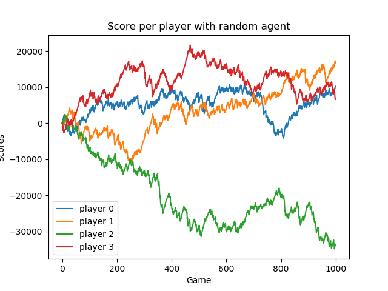

This repository is about training an agent to play
[French Tarot game](https://en.wikipedia.org/wiki/French_tarot]).
The game rule where taken from the [Official French Tarot Rules](http://www.fftarot.fr/assets/documents/R-RO201206.pdf)
from the French Tarot Federation.

The aim is to train this agent based on DQN, although this is not
implemented yet.

# Game introduction
TODO

# Repository structure
TODO

# Results
This section presents the findings obtained throughout the various
experiments.

## All-random games
We made agents play randomly for 1000 independent games and we made sure
each agent gets to be the starting player an equal amounts of times.
The total scores obtained when running the experiment with
different random seeds are as follows:

|Initial seed|Player 0|Player 1|Player 2|Player 3|
|---|---|---|---|---|
| 0 |10201|16641|-33599|6757|
| 10000| -4707 | 3697  | -7747  | 8757  |
| 20000|  82 | -30170  |7598   |22490   |

Evolutions of the score games after games for the first line (i.e. with
initial seed set to 0) are shown below:

We see that using 3 different seeds make very different results:
either one random player tends to lose a lot more, or scores are roughly
the same. Expectations would be that with a larger amount of games,
scores would tend to be closer.

# TODO
1. give short introduction to game's rules
2. describe repository structure
3. rerun random experiment with different seed and show results 
4. implement DQN-based agent and train it
5. make agent play against random agent
6. make agent play against human