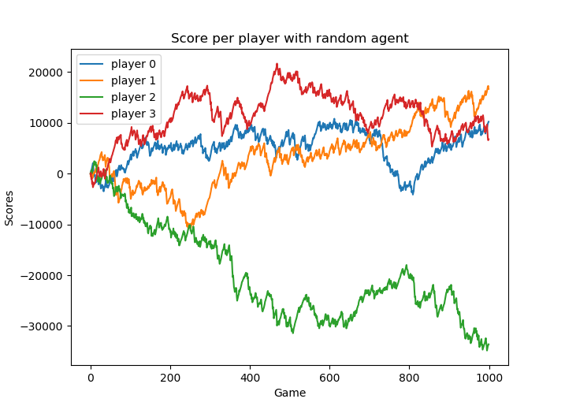

This repository is about training an agent to play
[French Tarot game](https://en.wikipedia.org/wiki/French_tarot]).
The game rule where taken from the [Official French Tarot Rules](http://www.fftarot.fr/assets/documents/R-RO201206.pdf)
from the French Tarot Federation.

The aim is to train this agent based on DQN, although this is not
implemented yet.

# Game introduction
TODO

# Repository structure
TODO

# Results
This section presents the findings obtained throughout the various
experiments.

## All-random games
We made agents play randomly for 1000 independent games and we made sure
each agent gets to be the starting player an equal amounts of times.
The total scores obtained when running the experiment with
different random seeds are as follows:

|Initial seed|Player 0|Player 1|Player 2|Player 3|
|---|---|---|---|---|
| 0 |10201|16641|-33599|6757|
| 10000| -4707 | 3697  | -7747  | 8757  |
| 20000|  82 | -30170  |7598   |22490   |

Evolutions of the score games after games for the first line (i.e. with
initial seed set to 0) are shown below:

We see that using 3 different seeds make very different results:
either one random player tends to lose a lot more, or scores are roughly
the same. Expectations would be that with a large amount of games,
scores would tend to be closer. Same experiment was run with 10000 games
per experiments and results were similar.

## With trained agent for bid phase
We tested having a neural network based agent for the bidding phase. It was trained on 200000 games. Everything else being
random, the agent would have better chance by not "taking the game", hence we would expect the agent to collapse
to the trivial solution of always passing. We test two different types of networks:
- angelica: simple feedforward net without weight sharing
- back_home: network designed for the purpose of french tarot with weight shared across card colors.
- carnival: same as back_home, except we don't use a reinforcement learning approach but rather the task
is to predict the probability of winning if a player takes the game w.r.t its hand

Results are summed-up in this
[Google Sheet](https://docs.google.com/spreadsheets/d/1jKxKGcHZPYEbEqXDQn-Qwko9_F8PxJigzj90CC79uZk/edit?usp=sharing).
The network that is fastest to train is "carnival", as it takes less than 1 hour, while angelica and back_home
take both around 6 hours. At the end of the training, the network decided to take the game 10.3% of the times,
which is satisfactory.

## With trained agent for dog phase
We tested having a DQN-based agent for the dog making phase as well. Since it's based on the same input (i.e, the cards
at hand), and we can assume the features to be extracted from the input would be close to what the neural would learn
from the bid phase, we share weights between them. This allows to significantly reduce the complexity and to train
both networks jointly.

The way the algorithm works is as follows:
1. Initialize input with cards at hand (including dog) and a vector $v_s$ of 78 zeros that will represent
the selected card so far
2. run the model. It's output is a vector $v_o$ of 78 components, one for each card.
3. Mask out all illegal card indices from $v_o$, i.e. cards that are not allowed in dog or not in player's hand
4. Get $i=argmax($v_o$). This will give us the picked up card.
5. Set $v_s[i] <- 1$
6. Repeat above procedure until we selected 6 cards.

To run this, we use the "carnival" neural net described in previous section for the bid phase agent.

# TODO
1. implement DQN-based agents for each phase and train them
    1. in bidding, use previous bids as input data
    2. in dog phase, create a state that distinguish cards taken from the dog (i.e. that other players know about) and cards that were already in hand
    3. in dog phase, test selecting cards one by one
2. give short introduction to game's rules
3. describe repository structure
4. make agent play against random agent
5. make agent play against human
